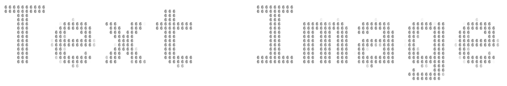

# text-image



English|[简体中文](./README-zh.md)

🐛🐛🐛 `text-image` can "textify" text, images, and videos, and can be used with simple configuration


## Website

https://sunny-117.github.io/text-image/

## Install

```bash
npm i @sunny-117/text-image
```

## Usage

```js
import { createTextImage } from '@sunny-117/text-image'
```

### Draw text

```js
import { createTextImage } from '@sunny-117/text-image'
createTextImage({
  // Required, configure the canvas element, and complete the final drawing on it
  canvas: document.querySelector('canvas'),
  // Optional, configure the text for drawing, default to '6'
  replaceText: '6',
  // Optional, configure drawing radius, the larger the value, the sparser it will be, default to 10
  raduis: 10,
  // Optional, configure whether to grayscale. If grayscale is enabled, colors will be lost, default to false
  isGray: false,
  // Required, configure drawing content
  source: {
    // Required, configure what text to draw
    text: 'Text Image',
    // Optional, configure the font used for text, CSS format, default to Microsoft Yahei
    fontFamily: 'Microsoft YaHei',
    // Optional, configure text size, default to 200
    fontSize: 200
  },
})
```

### Draw image

```js
import { createTextImage } from '@sunny-117/text-image'
createTextImage({
  // Required, configure the canvas element, and complete the final drawing on it
  canvas: document.querySelector('canvas'),
  // Optional, configure the text for drawing, default to '6'
  replaceText: '6',
  // Optional, configure drawing radius, the larger the value, the sparser it will be, default to 10
  raduis: 10,
  // Optional, configure whether to grayscale. If grayscale is enabled, colors will be lost, default to false
  isGray: false,
  // Required, configure drawing content
  source: {
    // Required, configure the image path for drawing
    img: 'path',
    // Optional, configure image width, default to the width of the image itself
    width: 500,
    // Optional, configure image height, default to the height of the image itself
    height: 300
  },
})
```


## Draw a video

```js
import { createTextImage } from '@sunny-117/text-image'
createTextImage({
  // Required, configure the canvas element, and complete the final drawing on it
  canvas: document.querySelector('canvas'),
  // Optional, configure the text for drawing, default to '6'
  replaceText: '6',
  // Optional, configure drawing radius, the larger the value, the sparser it will be, default to 10
  raduis: 10,
  // Optional, configure whether to grayscale. If grayscale is enabled, colors will be lost, default to false
  isGray: false,
  // Required, configure drawing content
  source: {
    // Required, configure the video path for drawing
    video: 'path',
    // Optional, configure video width, default to the width of the video itself
    width: 500,
    // Optional, configure video height, default to the height of the video itself
    height: 300
  },
})
```


# License

Released under the MIT License. Refer to the LICENSE file for more information."
